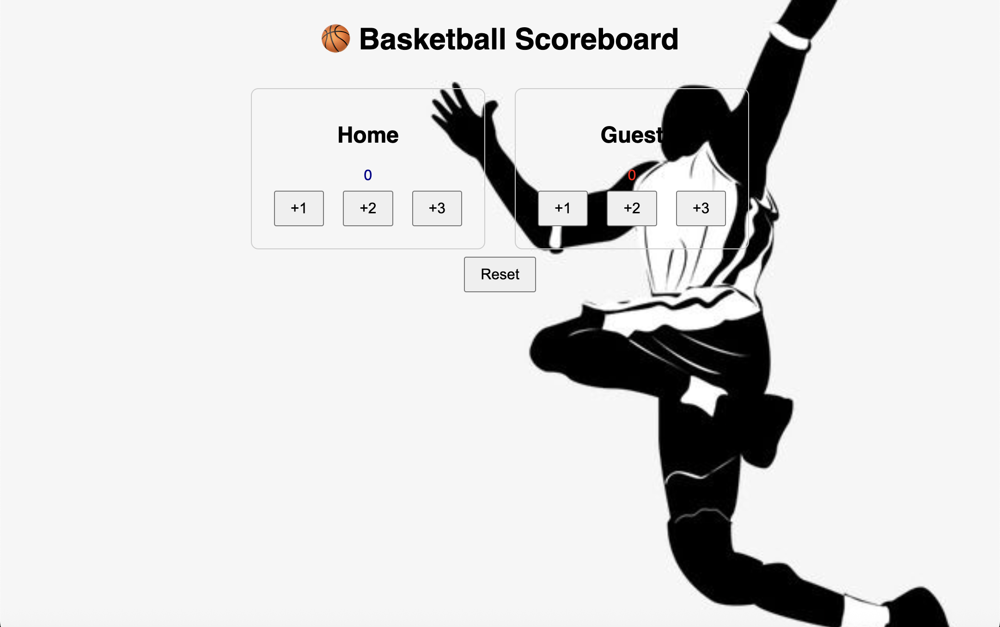
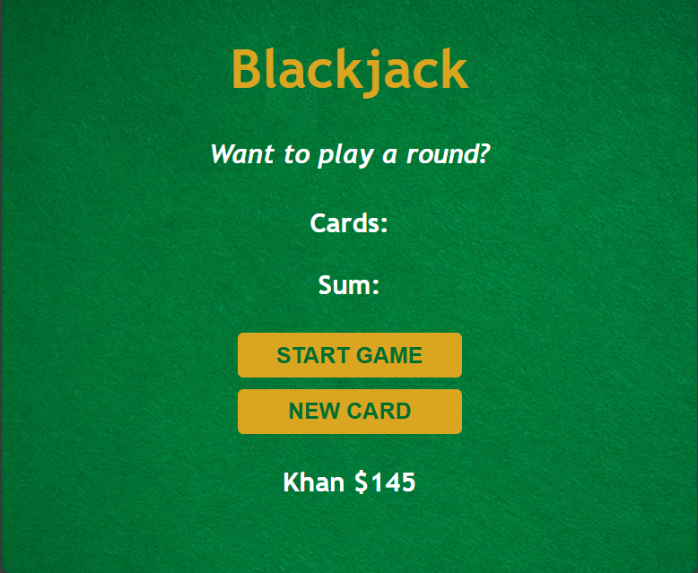
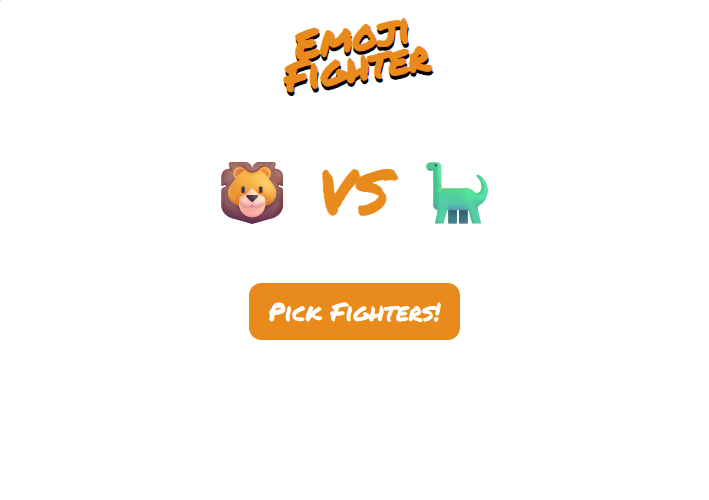
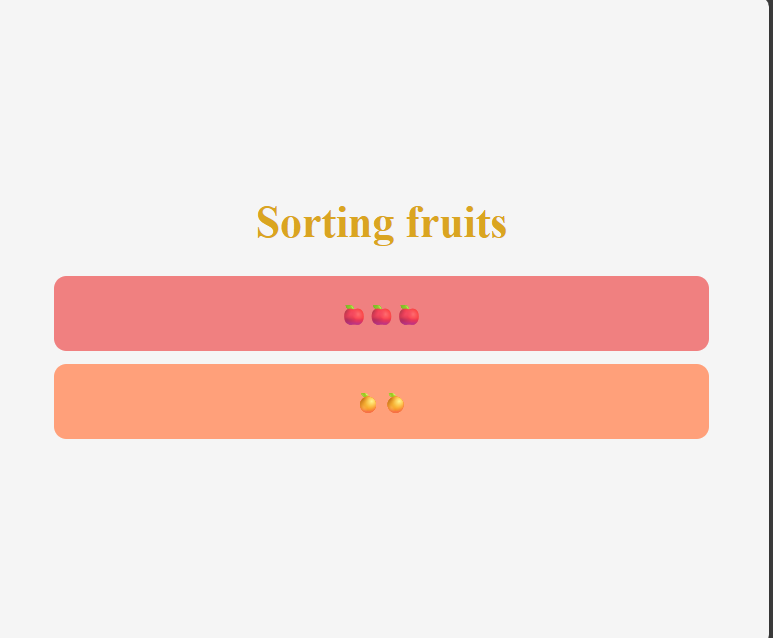

# JavaScript Mastery 2025

This repository documents my journey to mastering JavaScript in 2025.  
I'm revisiting JavaScript fundamentals through the Scrimba course to build a deeper understanding of the language before moving into backend development with Node.js.

## 🔥 Why This Repo?

I'm focused on writing clean, modular code while reinforcing core JavaScript concepts like:

- ✅ Variables & Data Types
- ✅ Functions & Scope
- ✅ Arrays & Objects
- ✅ DOM Manipulation
- ✅ Events & Forms
- ✅ ES6+ Features
- ✅ Asynchronous JavaScript (Promises, async/await)
- ✅ Error Handling & Debugging

## 📚 Source of Learning

- 🧠 [FreeCodeCamp](https://www.youtube.com/watch?v=jS4aFq5-91M)
- 📖 Additional practice from MDN, LeetCode, and small project challenges

## 📁 Folder Structure
/projects           → Mini projects (Todo App, Weather App, Quiz Game)
/notes              → Topic-wise JS notes
/challenges         → Practice questions & coding challenges
README.md

## 🧪 Goal

To become highly confident in vanilla JavaScript and build a strong foundation for moving into **Node.js** and full-stack development.

## 🌐 Connect with Me

- 💻 GitHub: [@Khan4218](https://github.com/Khan4218)
- 🌍 Portfolio: [Mir Akbar Ali khan Portfolio](https://mir-akbar-portfolio-react-v2.netlify.app/)

---
📈 JavaScript Mastery Progress Tracker (freeCodeCamp + Scrimba Hybrid)
## 🧠 JavaScript Mastery Tracker – Section 1

| 🧬 Topic                                             | ✅ Status   |
|------------------------------------------------------|-------------|
| 🔹 Intro                                             | ✅ Done      |
| 👥 Passenger Counter App                             | ✅ Done      |
| 🔧 Setting up file                                   | ✅ Done      |
| 🧮 Create variable                                   | ✅ Done      |
| ➕ Mathematical operations                           | ✅ Done      |
| 🔁 Reassigning & incrementing                        | ✅ Done      |
| 🔘 Adding button                                     | ✅ Done      |
| 🖱️ `onclick` event listener                          | ✅ Done      |
| 🔂 Using functions to write less code                | ✅ Done      |
| 🧪 First function                                    | ✅ Done      |
| 🧮 Function that logs sum                            | ✅ Done      |
| ➕ Function that increments                          | ✅ Done      |
| 🖲️ Increment on clicks                               | ✅ Done      |
| 📟 Display count                                     | ✅ Done      |
| 🧑‍🔧 Document Object Model (DOM)                       | ✅ Done      |
| ✍️ Display count using `innerText`                   | ✅ Done      |
| 💾 Create save button                                | ✅ Done      |
| 🔤 What is a string?                                 | ✅ Done      |
| 📝 First string variable                             | ✅ Done      |
| 💬 Log greeting to console                           | ✅ Done      |
| 🔢 Strings vs. Numbers                               | ✅ Done      |
| 🎉 Render welcome message                            | ✅ Done      |
| 🧵 Improve message using string concatenation        | ✅ Done      |
| ➕ Use `+=` for count                                | ✅ Done      |
| 💾 Create save feature                               | ✅ Done      |
| 🐞 Debugging online                                  | ✅ Done      |
| 🔄 Reset count to 0                                  | ✅ Done      |
| 📌 Recap of concepts                                 | ✅ Done      |
| 🎯 Variables practice                                | ✅ Done      |
| 🔗 Concatenate strings                               | ✅ Done      |
| ➕ Incrementing & decrementing                       | ✅ Done      |
| 🔠 Strings & numbers practice                        | ✅ Done      |
| 🚨 Rendering error message                           | ✅ Done      |
| 🧮 Calculator challenge                              | ✅ Done      |

---

## 🏀 Solo Project – Basketball Counter App

This is a solo project built as part of my Scrimba JavaScript learning path. It’s a simple basketball score counter app that allows you to track the Home and Guest team scores with +1, +2, and +3 buttons, as well as a reset button.

### 🔗 Live Demo

👉 [Click here to view the live app](https://akbar-solo-project-bb-counter-app.netlify.app/)

### 📁 Project Structure
solo-project/
├── index.html      # main HTML file
├── solop.css       # styles
└── solop.js        # JavaScript logic

### 💡 Features

- Add 1, 2, or 3 points for Home and Guest
- Live score updating
- Reset button to start a new game
- Background image support
- Team logos for Home and Guest teams

### 📸 Preview

🔗 Live Demo: [akba-passenger-counter-app.netlify.app](https://akba-passenger-counter-app.netlify.app)

---
## 🎮 JavaScript Mastery Tracker – Section 2: Blackjack Game Project

| 🧬 Topic                                                       | ✅ Status   |
|----------------------------------------------------------------|-------------|
| 🃏 Build Blackjack game                                        | ✅Done     |
| 🂡 Add `firstCard`, `secondCard`, & `sum`                       | ✅Done      |
| 🧾 If...else conditionals                                      | ✅Done       |
| 🔁 `if...else` statement                                       |  ✅Done      |
| 🔀 `if/else if/else` statement                                 |  ✅Done      |
| 💭 Boolean                                                     |  ✅Done      |
| 🧠 `hasBlackJack` variable                                     | ✅Done       |
| ❤️ `isAlive` variable                                          | ✅Done       |
| 💭 Practice boolean conditions                                 | ✅Done       |
| 📝 Add message variable                                        | ✅Done       |
| 🎨 Link stylesheet                                             | ✅Done       |
| 🧼 Add basic styling                                           | ✅Done       |
| ▶️ Make start button work                                      | ✅Done       |
| 📢 Display game message                                        | ✅Done       |
| ➕ Display sum                                                 | ✅Done       |
| 🃍 Display cards                                                | ✅Done       |
| ➕ New card button                                             | ✅Done       |
| 🔄 Add to sum when newCard is clicked                          | ✅Done       |
| ✏️ Rename `startGame` function                                 | ✅Done       |
| 🧮 Solve card problem using array                              | ✅Done       |
| 📚 Arrays introduction                                         | ✅Done       |
| 🔢 Array indexes                                               | ✅Done       |
| 🧬 Arrays with multiple data types                             | ✅Done       |
| ➕ Adding & removing items from arrays                         | ✅Done       |
| 🃏 Create cards array                                          | ✅Done       |
| 🆕 Push new card to array                                      | ✅Done       |
| 🔢 Counting elements                                           | ✅Done       |
| 🔁 Loops                                                       | ✅Done       |
| 🔁 For loops & arrays                                          | ✅Done       |
| 🔁 First array-based for loop                                  | ✅Done       |
| 🔁 For loops, arrays, & DOM                                    | ✅Done       |
| 🖼️ Use loop to render cards                                    | ✅Done       |
| ❌ Avoid hard-coded values                                     | ✅Done       |
| 🔄 Returning values from functions                             | ✅Done       |
| 🧮 Function to set card values                                 | ✅Done       |
| 🎲 Generate random numbers with `Math.random()`                | ✅Done       |
| 🎲 `Math.random() * 6`                                         | ✅Done       |
| 📉 Flooring number with `Math.floor()`                         | ✅Done       |
| 🎲 Create dice function                                        | ✅Done       |
| ✅ Complete dice logic                                         | ✅Done       |
| 🔧 Make `getRandomCard()` work                                 | ✅Done       |
| 🔢 `getRandomNumber` function                                  | ✅Done       |
| 🔁 Assign values in `startGame`                                | ✅Done       |
| 🐞 Fix card feature                                            | ✅Done       |
| 🧠 Logical AND operator                                        | ✅Done       |
| 🔗 Logical operators overview                                  | ✅Done       |
| 🧠 Logical OR operator                                         | ✅Done       |
| 🚫 Only trigger `newCard()` if allowed                         | ✅Done       |
| 🧠 Object sneak peek                                           | ✅Done       |
| 🧱 Create first object                                         | ✅Done       |
| 🧍 Store player data                                           | ✅Done       |
| ⚙️ Methods on object                                           | ✅Done       |
| 🔁 Recap of core concepts                                      | ✅Done       |
| 🧩 Objects & functions                                         | ✅Done       |
| 🧾 `if else` practice                                          | ✅Done       |
| 🔁 Loops & arrays                                              | ✅Done       |
| 🧪 `push()`, `pop()`, `unshift()`, `shift()` challenge         | ✅Done       |
| 🧠 Logical operators usage                                     | ✅Done       |
| ✊ Rock, Paper, Scissors game                                  | ✅Done       |
| 👌 Emoji Fighter                                               | ✅Done       |
| 🍎 Sorting fruits mini app                                     | ✅Done       |

### 📁 Project Structure
 02.build-a-black-jack-app
│   ├── challenges
│   │   ├── challenges.html
│   │   └── challenges.js
│   ├── img
│   │   └── table.png
│   ├── index.css
│   ├── index.html
│   ├── index.js
│   ├── notes
│   │   └── takeNotes.js
│   ├── practice
│   │   ├── pracrice.html
│   │   └── practice.js
│   ├── preview-images
│   │   ├── Black-jack.png
│   │   ├── Emoji-fighter.png
│   │   └── sorting-fruits.png
│   └── recap-core-concepts
│       ├── emoji-fighter-game
│       │   ├── emoji.css
│       │   ├── emoji.html
│       │   └── emoji.js
│       ├── recap.html
│       ├── recap.js
│       └── sorting-fruits
│           ├── fruits.css
│           ├── fruits.html
│           └── fruits.js

## About this section 
## 🎮 JavaScript Mastery Tracker – Section 2: Blackjack Game Project

In this section, I built a complete **Blackjack game project** from scratch using core JavaScript concepts. The project began with declaring variables like `firstCard`, `secondCard`, and `sum`, and using `if...else` and `if/else if/else` statements to determine game outcomes. I practiced working with **Booleans**, created game state flags (`hasBlackJack`, `isAlive`), and dynamically displayed messages, sums, and cards on the page.

I deepened my understanding of **arrays** by using them to manage drawn cards, learning how to `push`, `pop`, and loop through arrays efficiently. I also learned to generate random numbers using `Math.random()` and `Math.floor()` to simulate card draws. As the game progressed, I transitioned from hard-coded values to dynamic rendering using `for` loops.

Additionally, I got hands-on with **objects**, using them to store player data and define methods, giving a sneak peek into object-oriented programming. I wrapped up with fun challenges like **Rock, Paper, Scissors**, **Emoji Fighter**, and a **fruit sorting mini app**, reinforcing my skills in functions, loops, conditionals, arrays, and DOM interaction.

### 📸 Preview

🔗 Live Demo: [black-jack-game-akbar.netlify.app](https://black-jack-game-akbar.netlify.app/)

💻 Chrome Extension Project

## 💻 JavaScript Mastery Tracker – Section 3: Chrome Extension Project

| 🧬 Topic                                                            | ✅ Status   |
|----------------------------------------------------------------------|-------------|
| 🧩 Build Chrome Extension                                           | ⬜ Notyet   |
| 🔘 Add button & input tag                                           | ✅ Done     |
| 🎨 Style button & input tag                                         | ✅ Done     |
| 🖱️ Make input button work with `onclick`                            | ✅ Done     |
| 🔁 Refactor to `addEventListener`                                   | ✅ Done     |
| ➕ Use `addEventListener()`                                         | ✅ Done     |
| 🔄 Further event handling refactoring                               | ✅ Done     |
| 📥 Create `myLeads` array & `inputEl` variable                      | ✅ Done     |
| 🧠 Use of `let` & `const`                                           | ✅ Done     |
| ➕ Push input value to `myLeads`                                    | ✅ Done     |
| 🧾 Use `for` loop to log leads                                      | ✅ Done     |
| 📄 Create unordered list                                            | ✅ Done     |
| 🖼️ Render leads in unordered list                                   | ✅ Done     |
| 🧪 Practice with `innerHTML`                                        | ✅ Done     |
| 🧪 More `innerHTML` usage                                           | ✅ Done     |
| 🧱 Use `createElement()` & `append()` instead of `innerHTML`        | ✅ Done     |
| ⚙️ Improve app performance                                          | ✅ Done     |
| 🔁 Create reusable `render()` function                              | ✅ Done     |
| ❌ Clear input field                                                | ✅ Done     |
| 🔗 Add `<a>` tag for saved links                                    | ✅ Done     |
| 🧵 Template strings introduction                                    | ✅ Done     |
| 📝 Write a basic template string                                    | ✅ Done     |
| 🔄 Make template string dynamic                                     | ✅ Done     |
| 📜 Multi-line template strings                                      | ✅ Done     |
| 🛠️ Refactor app with template strings                               | ✅ Done     |
| 🎨 Style `<ul>` and `<li>` list                                     | ✅ Done     |
| 🚀 Prepare for deployment                                           | ✅ Done     |
| 🌐 Deploy Chrome Extension                                          | ✅ Done     |
| 💾 What is `localStorage`?                                          | ✅ Done     |
| 💾 Use `localStorage` to save values                                | ✅ Done     |
| 🧪 Store arrays in `localStorage`                                   | ✅ Done     |
| 💾 Save leads to `localStorage`                                     | ✅ Done     |
| 📥 Retrieve leads from `localStorage`                               | ✅ Done     |
| 🔍 Truthy vs Falsy expressions overview                             | ✅ Done     |
| ❓ Guessing truthy/falsy values                                     | ✅ Done     |
| ✅ Check `localStorage` before rendering                            | ✅ Done     |
| 🧹 Add delete button                                                | ⬜ Not yet   |
| 🧼 Make delete button functional                                    | ⬜ Not yet   |
| 🧠 Understand how function parameters improve code                  | ⬜ Not yet   |
| 📝 Define function with parameters                                  | ⬜ Not yet   |
| 🧠 Use functions with multiple parameters                           | ⬜ Not yet   |
| 🔢 Pass numbers as function arguments                               | ⬜ Not yet   |
| ⚙️ Parameters vs Arguments explained                                | ⬜ Not yet   |
| 🧩 Pass arrays as parameters                                        | ⬜ Not yet   |
| 🔁 Refactor `renderLeads()` with parameter                          | ⬜ Not yet   |
| 🔘 Create `tabBtn` for saving current tab                           | ⬜ Not yet   |
| 🌐 Save current tab’s URL                                           | ⬜ Not yet   |
| 🧪 Use Chrome API to access tab data                                | ⬜ Not yet   |
| 🚀 Deploy final extension version                                   | ⬜ Not yet   |
| 🧾 Final recap of Chrome extension concepts                         | ⬜ Not yet   |
| 🧠 Practice & polish extension functionality                        | ⬜ Not yet   |
| 🎬 Outro – JavaScript project wrap-up                               | ⬜ Not yet   |
# Passenger Counter App

This project is part of my advanced JavaScript mastery journey. Although I've already built modern web apps with React and TypeScript, I'm revisiting core JavaScript fundamentals to strengthen my foundation.

## 💡 Purpose

Even small projects like this one reinforce key DOM concepts like:

- `document.getElementById`
- `innerText` manipulation
- Event listeners and click handling

## 🧠 What's Different This Time

- Writing clean, modular code
- Naming variables meaningfully
- Focusing on reusability and clarity
- Practicing Git commits with intention

## 🚀 Built With
- HTML
- CSS
- JavaScript (Vanilla)